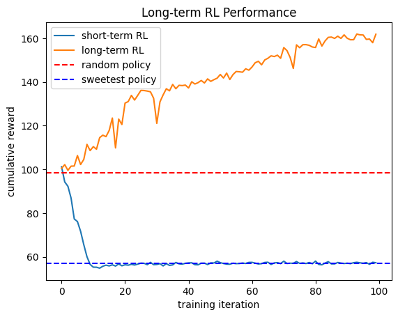

# Recommender System RL Tutorial

강화학습 (RL, reinforcement learning) 기반의 추천 시스템 (recommender system) 구축에 대한 튜토리얼입니다. 간단한 toy problem으로부터 추천 시스템의 목적, 프로세스, 강화학습의 유용성 등 여러 주제를 Python code와 함께 다룹니다.

Tutorial notebook: [recsys_rl_tutorial.ipynb](/recsys_rl_tutorial.ipynb)

RL Performance Result in Recommender System:



이 튜토리얼은 Anyscale "[ACM RecSys 2022 Tutorial](https://github.com/anyscale/academy/tree/main/ray-rllib/acm_recsys_tutorial_2022)"   (Github)를 기반으로 만들어졌습니다. 튜토리얼 설명을 완전히 재작성하였으며, 한글로 작성했습니다. 또한, 패키지 dependency 문제와 기존 레거시 코드로부터 발생하는 에러들을 해결해 최신 API들과 호환되도록 수정하였습니다.

> TODO: Offline RL section은 추후 추가될 예정입니다.

## Setup

이 튜토리얼은 Linux (Ubuntu 20.04) OS에서 실행되었습니다. 다른 환경에서도 정상 작동하는지는 확인하지 않았습니다.

Anaconda 환경은 선택 사항입니다. 여기서는 [Python 3.10](https://www.python.org/)을 사용했습니다:

```bash
conda create -n recsys-tutorial python=3.10 -y
conda activate recsys-tutorial
```

아래 패키지를 설치합니다:

```bash
pip install "ray[rllib]" torch
pip install recsim==0.2.4
pip install ipykernel==6.25.2
pip install matplotlib==3.7.2
```
